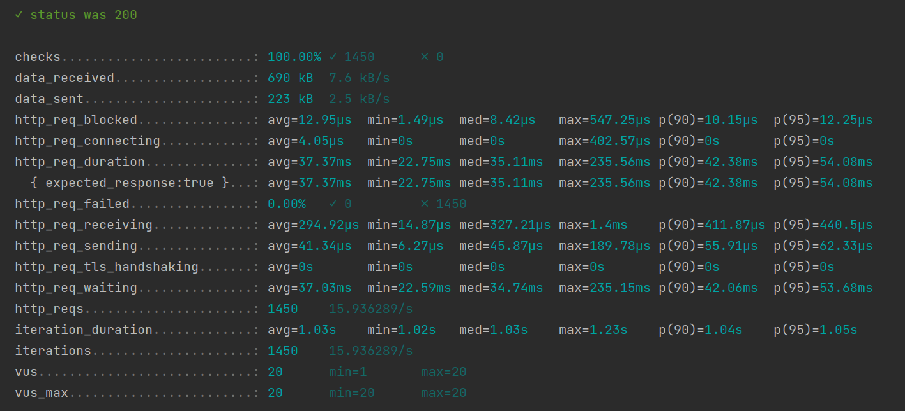

# Poc Sync Data

POC to use DynamoDB as Primary Database and S3 as failover.

## Postman collection

Run with postman collection **./postman**.

## Performance test

* Run the [K6](https://k6.io/) scripts

  Post:

   ```sh
   cd k6
   k6 run post-script.js
   ```
  


Get:

   ```sh
   cd k6
   k6 run get-script.js
   ```



Docs:

Active profile:

```sh
-Dspring.profiles.active=local
```

[DynamoDB Transactions](https://docs.aws.amazon.com/amazondynamodb/latest/developerguide/DynamoDBMapper.Transactions.html)

