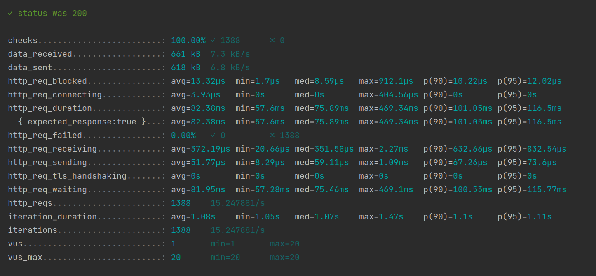
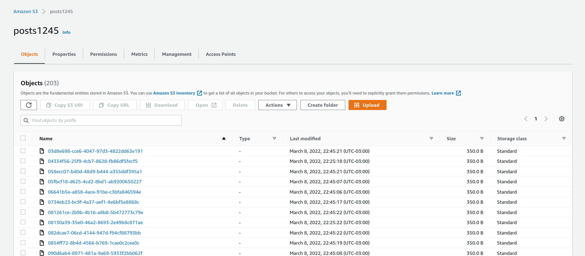

# Crud App Using S3

POC to use S3 as Storage Repository

## Postman collection

Run with postman collection **./postman**.

## Performance test

* Run the [K6](https://k6.io/) scripts

   Post:

   ```sh
   cd k6
   k6 run post-script.js
   ```
  


   Get:

   ```sh
   cd k6
   k6 run get-script.js
   ```
  

